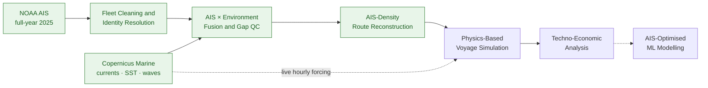

# Liquified-CO2-Transport-Techno-Economic-Analysis

An hourly, physics-based simulation of liquefied-CO₂ (LCO₂) carriers moving between three real Gulf Coast industrial corridors and an offshore carbon capture 
and storage (CCS) hub. Built on a full year of cleaned AIS vessel traffic and live Copernicus Marine ocean/wave data, and used to calculate cost per tonne of CO₂ delivered.

## Contents

- [Introduction](#introduction)
- [Pipeline](#pipeline)
- [Data Sources](#data-sources)
- [Data Engineering Pipeline](#data-engineering-pipeline)
- [Planned Physics-Based Voyage Simulation](#physics-based-voyage-simulation)
- [Planned Techno-Economic Analysis](#techno-economic-analysis)
- [Repository Structure](#repository-structure)
- [Tech Stack](#tech-stack)
- [References](#references)

## Introduction

Carbon capture and storage is moving from pipelines to ships.  A joint venture (Northern Lights) between Equinor, Shell, and TotalEnergies proved the concept in the North Sea and began commercial operations in 2025, and BIMCO adopted the first standardized liquefied-CO₂ time-charter form (CO2TIME 2026) this year as the trade moves from pilot projects to commercial reality. The US Gulf Coast is one of the next frontiers: [Bayou Bend](https://bayoubend.com), a Chevron-operated joint venture with Equinor and TotalEnergies spanning roughly 140,000 onshore and offshore acres of pore space along the Texas coast, is one of several large-scale CO₂ storage hubs now under development along one of the world's most industrially dense coastlines.
Nearby, the [ExxonMobil / Denbury](https://corporate.exxonmobil.com/news/news-releases/2023/0713_exxonmobil-announces-acquisition-of-denbury) network adds another large-scale storage development to the Texas Gulf Coast, reinforcing the emergence of a regional network of capture, transport, and storage sites.

Its logistics look different from a North Sea crossing. Rather than one long transit, Gulf CCS shipping means short, high-frequency corridors linking refining and petrochemical clusters to an offshore hub — and at that scale, weather, sea state, and turnaround time dominate the economics far more than they would on a long deep-sea voyage. This project builds a first-principles, weather-resolved simulation of this problem: three real corridors, three representative carrier sizes, a full year of hourly operation, and a cost model of dollars per tonne delivered.

The work sits in two layers. The **data foundation** - a year of NOAA AIS traffic cleaned into a real Gulf tanker fleet, fused with Copernicus Marine ocean and wave reanalysis, and used to reconstruct sailing corridors from actual vessel behavior rather than straight lines on a map . The **simulation and economics engine** to be built on top of it.


## At a Glance

| | |
|---|---|
| **AIS traffic processed** | 4.29M raw position reports → 365,318 validated observations across **1,720 vessels** in the Gulf study region |
| **Ocean/wave data fused** | 12 months of hourly Copernicus Marine reanalysis (currents, SST) plus a companion wave product, for the full 2025 calendar year |
| **Routes** | 3 real corridors into a single offshore CCS hub, geometry checked against AIS traffic density (85–88% AIS-supported) |
| **Simulation scale** | 3 ship classes × 3 routes × 8,760 hours/year = **78,840 simulated vessel-hours** per annual run cycle |
| **Output schema** | Hourly file spanning kinematics, weather, hydrodynamics, propulsion, fuel, boil-off, and techno-economics |
| **Weather realism** | Every environmental value is a live Copernicus read or a same-dataset nearest-neighbor fill |

## Pipeline



🟢 data-validated, with figures &nbsp;·&nbsp;  ⚪ Ongoing development


## Data Sources

| Source | Role | Detail |
|---|---|---|
| **NOAA AIS** (Marine Cadastre) | Vessel traffic | Full 2025 calendar year, extracted day-by-day with a restartable progress tracker; used to build the real Gulf tanker fleet and to mine route geometry from observed traffic. DATA SOURCE : https://noaaocm.blob.core.windows.net/ais/csv2/csv2025/index.html |
| **Copernicus Marine Service** — physics product | Currents + sea surface temperature | `cmems_mod_glo_phy_anfc_0.083deg_PT1H-m`, hourly, global 1/12° analysis-forecast. DATA SOURCE : https://data.marine.copernicus.eu/product/GLOBAL_ANALYSISFORECAST_WAV_001_027/files?subdataset=cmems_mod_glo_wav_anfc_0.083deg_PT3H-i_202411 |
| **Copernicus Marine Service** — wave product | Significant wave height, period, direction | Companion wave analysis-forecast product at 3-hourly resolution, interpolated onto the same hourly trajectory. |


## Data Engineering Pipeline

### AIS data cleaning 

| Stage | Rows remaining | Vessels |

1. Raw NOAA data extracted
2. Sparse data and noise removed
3. Identity resolution (IMO vs. MMSI - 45 IMOs had reported multiple MMSIs), cargo/vessel-type reconciliation (300 ships with conflicting codes, 170 toggling to/from the "no info" class), and geographic + navigation-status screening 
4. Removed near-stationary pings (SOG < 1 kn ) 

| **Final Gulf-of-Mexico study region** | **365,318** | **1,720** |

Exported as a cleaned fleet file with `BaseDateTime, LON, LAT, SOG, COG, Heading, IMO, Status, Length, Width, Draft, Cargo` plus an engineered `drift_angle` field, with remaining 365,318 rows and 1,720 ships

### AIS and environmental fusion 
Rather than filling missing values blindly, the missing data was diagnosed first:

| Diagnostic | Result |
|---|---|
| Vessels with at least some missing environmental data | 1,645 of 1,720 |
| Vessels with zero missing data | 75 |
| Observations missing the current field (`uo`) | 74,282 |
| Distance-to-coast for those observations | median ≈ 5.4 km, mean ≈ 10.2 km |
| → Coastal gaps (< 10 km from shore) — current/wave set to zero, temperature interpolated | 50,167 |
| → Deep-water gaps — filled by nearest-neighbor interpolation | 24,115 |
| Remaining nulls after treatment | 0 |

The diagnostic mattered: most of the missingness turned out to be concentrated at the coastline/port mask rather than scattered randomly, which is a different problem (and a different fix) than a sensor dropout would be.

### Route reconstruction from real traffic

 The routes were mined from actual AIS density: pings at SOG ≥ 5 kn (91.4% of the Gulf dataset) were binned onto a ~1 km grid, converted into a vessel-density traversal-cost surface with a land/water mask, and searched with a least-cost path algorithm anchored at each origin and the CCS hub . The resulting path checked both numerically (the AIS-support fraction in the table above) and visually, against an AIS density heatmap, before being accepted. This is a much accurate method compared to assuming a straight path.

## Physics-Based Voyage Simulation

The planned simulation engine will take the schedule, weather, and physics chain and run it to build hourly voyage schedule for a period of one year. Then it would compute resistance, power, efficiency, fuel, and boil-off for all 8,760 hours.

**Physics building blocks:**

| Component | Method | Purpose in the model |
|---|---|---|
| Frictional resistance | ITTC-1957 correlation line, with seawater density/viscosity varying with sea surface temperature | Baseline hull drag |
| Calm-water power | Admiralty-coefficient method, temperature-corrected | Design-speed power at laden/ballast draft |
| Propulsion train | Wageningen B-series-style open-water, hull, relative-rotative, and shaft efficiency chain | Delivered power → propeller thrust |
| Added resistance in waves | Faltinsen-type formulation (wave steepness, block coefficient, Froude-number correction) | Wave-resistance component |
| Speed loss in waves | Kwon-type parametric model — Beaufort-derived wind/wave coefficient × encounter-angle factor × steepness factor | % speed loss → speed through water |
| Engine fuel rate | SFOC-vs-engine-load curve | g/kWh → hourly fuel burn |
| Boil-off gas | Heat-ingress model (tank U-value × area × ΔT, augmented by sea state) | Cargo shrinkage over the voyage |

**Weather realism :** No use of synthetic or climatological weather generator. Every `Hs`, `Tp`, wind, current, and SST value is either a direct Copernicus read or, for the rare cell Copernicus itself has no data for, a nearest-neighbor would fill from a real grid cell in that dataset. 

## Techno-Economic Analysis

A cost model that would convert the physical simulation into cost per tonne delivered:

| Component | Driver |
|---|---|
| Fuel | Bunker price plus a shadow carbon price applied to the ship's own combustion emissions |
| Port calls | Per-call cost by ship class, twice per voyage |
| Buffer storage | Shore-side buffer sized off the fleet's realized daily throughput |
| Liquefaction | Per-tonne OPEX (compressor electricity + O&M) |
| Ship OPEX | Per-day running cost by ship class |

Main outputs will include **transport cost per tonne**, **full-chain cost per tonne** (transport + liquefaction), **specific emissions** (kg CO₂ per tonne-km), and **vessel utilization**.


## Repository Structure

```
lco2-gulf-transport/
├── README.md
├── Data Processing/
│   ├── NOAA_AIS_extraction.ipynb                  # Extracting NOAA data
│   └──  ais_weather_download_fusion.ipynb         # Extracting and fusing weather (Copernicus) data with NOAA data
└── Data preparation and analysis/
    ├── NOAA_data_analysis.ipynb                   # Cleaning and processing NOAA data
    ├── ais_weather_data_processing.ipynb          # Cleaning and processing fused NOAA and weather data
    └── waypoints_ais_data.ipynb                   # Extracting waypoints from NOAA data
```

## Tech Stack

**Core:** Python, pandas, NumPy, SciPy (`gaussian_filter1d`, `cKDTree`, signal filtering)
**Ocean data:** `xarray`, `copernicusmarine`, NetCDF/Zarr
**Geospatial:** `geopandas`, `shapely`, `fiona`, `global_land_mask`, `skimage.graph` (least-cost path search), `movingpandas`
**Visualization / QA:** `holoviews`, `geoviews`, `cartopy`, `hvplot`, `plotly`, `matplotlib`, `seaborn`
**Environment:** Google Colab 


## References

Methods and constants will be drawn from (see the simulation script for the exact formula-to-source mapping):

- **Kwon (2008)** — parametric speed-loss-in-waves method, the same family of approach referenced in IMO EEXI weather-correction guidance
- **ITTC-1957** — standard frictional-resistance correlation line
- **Watson, *Practical Ship Design* (1998)** — Admiralty-coefficient calm-water powering method
- **Sharqawy et al. (2010)** — seawater thermophysical property correlations
- **Wageningen B-series** — systematic propeller series underlying the propulsion-efficiency chain
- **MAN Energy Solutions** — SFOC-vs-engine-load reference curves
- **Faltinsen** — added-resistance-in-waves formulation
- **Miana** — boil-off / heat-ingress modeling for cryogenic cargo
- **NIST Chemistry WebBook** — CO₂ thermophysical properties
- **IEAGHG (2014); IEA GHG PH4/30** — CO₂-shipping techno-economic baselines
- **DNV** — classification-society rules and guidance
- **HullPIC** — hull-performance / antifouling correlation
- **NOAA AIS** (Marine Cadastre) and **Copernicus Marine Service (CMEMS)** — the underlying vessel-traffic and ocean/wave datasets
